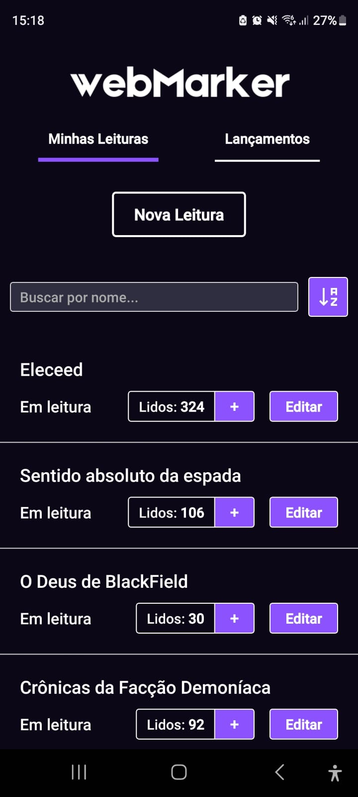
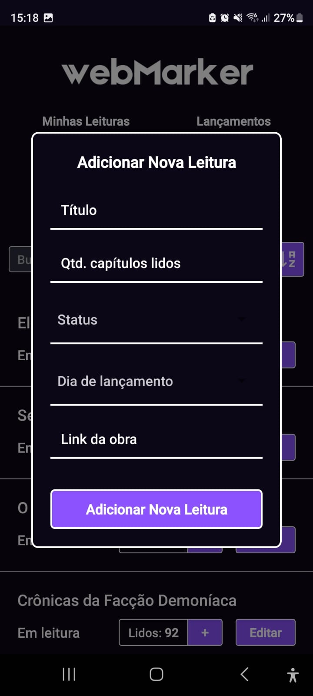

# WebMarker Mobile

O WebMarker é uma aplicação web projetada para facilitar a organização e o acompanhamento das suas leituras. Com esta ferramenta intuitiva, você pode registrar, editar e excluir facilmente informações sobre as obras que está lendo, mantendo-se sempre atualizado e organizado.

## Tecnologias Utilizadas

* **React Native**: Um framework poderoso para o desenvolvimento de aplicativos móveis, permitindo criar interfaces nativas para iOS e Android com um único código base.
* **SQLite**: Um banco de dados leve e eficiente, utilizado para armazenar e gerenciar os dados das leituras dos usuários de forma segura e acessível.
* **Expo**: Uma plataforma que simplifica o desenvolvimento e a construção de aplicativos React Native, permitindo um fluxo de trabalho mais ágil e eficiente.

## Funcionalidades em destaque

* **Registro de Leituras**: Adicione novos livros à sua lista de leitura com detalhes como título, link e progresso.
* **Gerenciamento Flexível**: Edite informações existentes conforme avança na leitura ou suas preferências mudam.
* **Interface Amigável**: Uma interface limpa e responsiva garante uma experiência agradável em qualquer dispositivo.
* **Redirecionamento**: Adicionando o link da obra, é possível ir, com um clique, até a página onde ela se encontra.
* **Lançamentos do Dia**: Fique por dentro das obras que você acompanha, com uma aba dedicada aos lançamentos do dia atual e dos próximos dias.
* **Atualização de Progresso**: Atualize facilmente seu progresso com um botão ao lado do capítulo atual, tornando o acompanhamento da sua leitura ainda mais prático.

## Experimente a aplicação!

Caso queira testar ou utilizar a aplicação, o APK se encontra na pasta `apk`. Sinta-se à vontade para baixar e experimentar a aplicação em seu dispositivo.

# A aplicação

## Lista de Leituras

A tela principal do aplicativo exibe uma lista organizada com todas as obras cadastradas. Ao clicar no botão "Nova Leitura", um modal é aberto para o cadastro de uma nova obra. Cada linha da lista representa uma obra individual e inclui o título, que, ao ser clicado, redireciona o usuário para o link cadastrado. 

Além disso, o status da leitura é exibido, indicando se a obra está marcada como "Em leitura" ou "Completo". Para facilitar o acompanhamento, a tela mostra também a quantidade de capítulos lidos. O botão "+" ao lado da quantidade permite que você aumente o progresso de leitura de forma rápida e intuitiva, sem a necessidade de formulários adicionais. Por fim, o botão "Editar" possibilita a modificação de quaisquer informações relacionadas a cada obra, garantindo que você tenha sempre os dados mais atualizados.

## Nova Leitura

Ao clicar no botão "Nova Leitura", um modal é apresentado, permitindo que você insira os dados da nova obra. Todos os campos devem ser preenchidos; caso contrário, o envio será impedido. Após preencher as informações necessárias, clique em "Adicionar Nova Leitura" para cadastrar a nova obra na sua lista. Para fechar o modal, basta clicar fora dele, retornando facilmente à tela anterior.

## Editar

Na tela de edição, você pode modificar os detalhes da obra selecionada. O modal apresenta os mesmos campos que a tela de "Nova Leitura", permitindo que você altere as informações conforme necessário. Além disso, há dois botões disponíveis: "Alterar", que salva as modificações feitas, e "Excluir", que remove a obra da sua lista. É uma maneira prática de manter suas leituras sempre atualizadas. Para fechar o modal, basta clicar fora dele, retornando facilmente à tela anterior.

## Releases

A aba de Releases apresenta todas as obras organizadas por dia de lançamento, começando pelo dia da semana atual. Essa funcionalidade é especialmente útil para ficar por dentro das novidades. Vale ressaltar que obras com o status "Completa" não são exibidas nesta aba, garantindo que você veja apenas os lançamentos que ainda está acompanhando.

